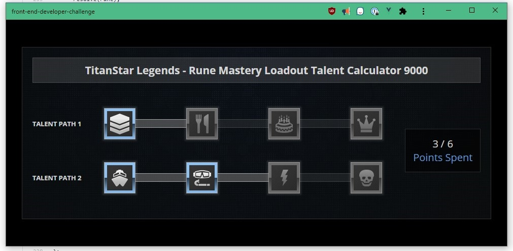

# Front-End Developer Challenge
This repo contains the results of [the coding challenge](https://github.com/DnDBeyond/front-end-developer-challenge) for D&D Beyond.

I built this with the goal to demonstrate competencies with the JavaScript language, a modern stateful JavaScript framework, state management, unit testing, documentation, and design.  As such, it can be difficult to strike a good balance between demonstrating competencies and adding too much complexity, so  **if you feel that any competency should be expanded on (e.g. E2E testing, SPA routing, etc), please let me know and I can add it.**

## Demo site
You can quickly test the demo application by using the following link:

https://friendly-lamarr-693562.netlify.app/

## Screenshots

### Desktop view (PWA mode)


### Mobile view


## Features
### Business rules
- Left click (touch for mobile) to add points.
- Right click (touch and hold for mobile) to remove points.
- The user may only use up to 6 points.
- Each item only accounts for one point.
- Displays current point total"
- The user must select the items in order.
- No existing CSS frameworks were used.
- SCSS was used to build the application.

### Other functionality
- The page responsively collapses and reorganizes its elements below 950px to support the smaller screen size.  Most notably, the 
- The application is PWA enabled.
- The application has example unit tests for most major functions.

## Future enhancements
- The business rule to use "left click" and "right click" conflicts with mobile device functionality, which only has touch and touch+hold.  I assumed right click means touch+hold on mobile for the purposes of this challenge.
- Data is managed through a centralized store for two primary extensibility reasons:
  - It is expected that this application should support fetching data through API calls.  The store is currently structured to make that transition easy (e.g. using `then()` in the store on Promises returned by `fetch` in an `api.js`).
  - It is also expected that this application should support notifications informing the user in the event of an error (e.g. "You have no more action points").  Again, this is made easy by chaining the Promise from the API functions, through the store, up to the UI concerns on the components.
- Unit test coverage only covers major areas of the application to prove competency.  If 100% coverage is desired, please let me know. 
- The background provided does not fully support a mobile layout.

## Project setup
Use the following command to install dependencies:
```
npm install
```

### Compiles and hot-reloads for development
To view in development mode, use the following command in a bash-like terminal:
```
npm run serve
```

### Activate debug messages
In a browser console, type the following:
```javascript
localStorage.debug = "*,-sockjs-client:*"
```
This application uses the [debug](https://www.npmjs.com/package/debug) package to display its logs.  More configuration information can be found on their main page.

### Compiles and minifies for production
```
npm run build
```

### Run your unit tests
```
npm run test:unit
```

### Lints and fixes files
```
npm run lint
```
